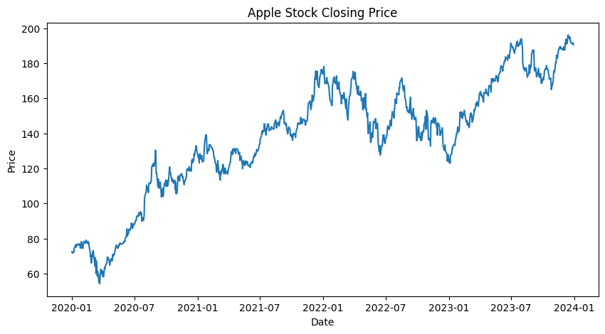
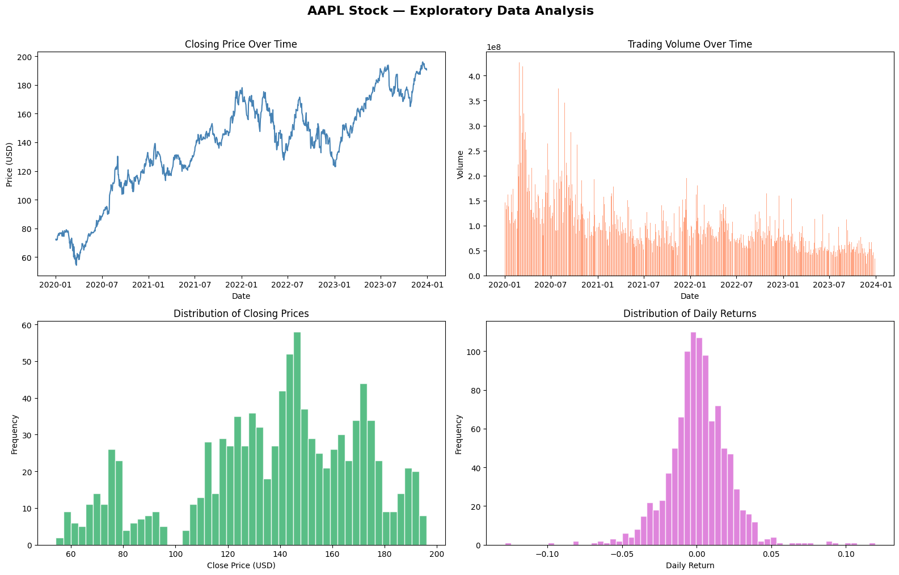
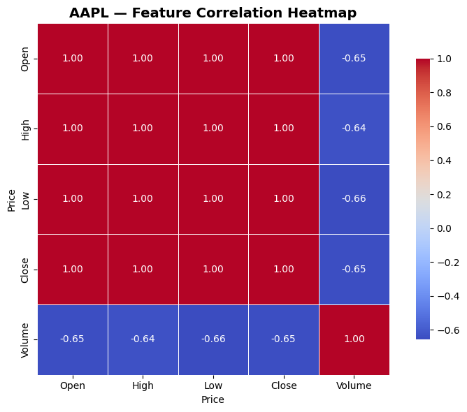
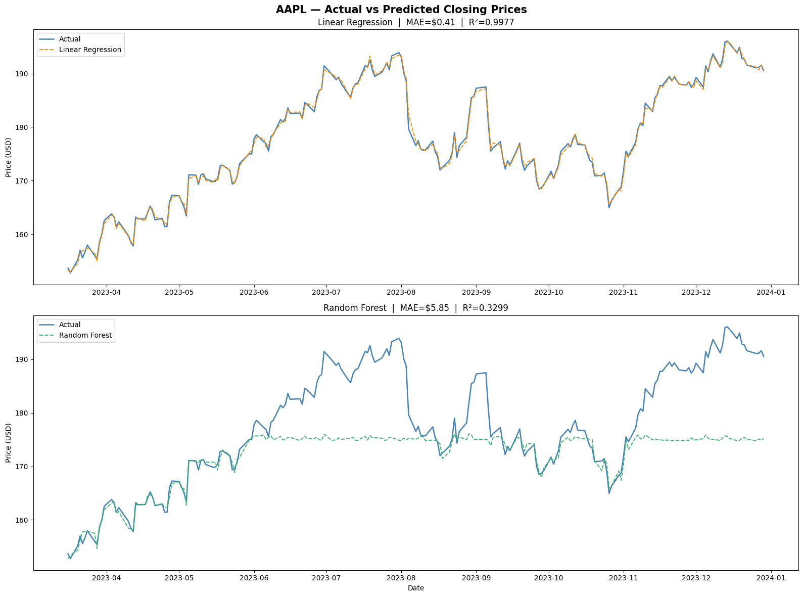
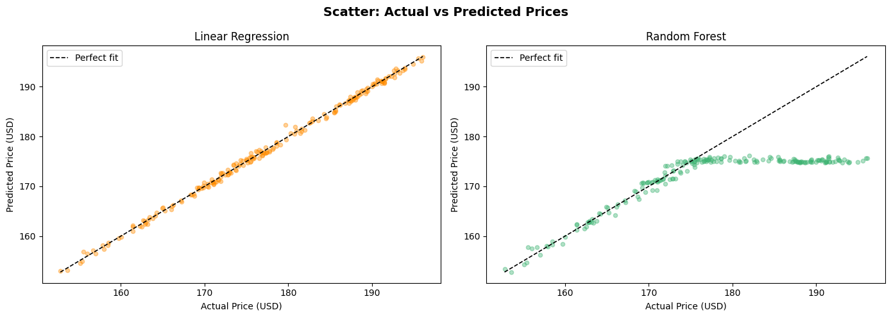

 # Stock-Price-Prediction-Using-Machine-Learning

This repository contains AI/ML internship tasks completed at DevelopersHub Corporation, focusing on stock price prediction using machine learning models.

---

# Tasks Overview

| Task | Title | Status |
|------|-------|--------|
| Task 1 | Exploring and Visualizing the Iris Dataset |  Complete |
| Task 2 | Predict Future Stock Prices |  Complete |
| Task 3 | Heart Disease Prediction |  Upcoming |
| Task 4 | General Health Query Chatbot |  Upcoming |
| Task 5 | Mental Health Support Chatbot |  Upcoming |
| Task 6 | House Price Prediction |  Upcoming |

---

# Task 2: Predict Future Stock Prices

# Objective
Use historical stock market data to predict the next day's closing price using machine learning models.

---

# Dataset Information
Source: Yahoo Finance (yfinance API)  
Stock: Apple (AAPL)  
Time Period: 2020 – 2024  

Features Used:
- Open  
- High  
- Low  
- Volume  

Target:
- Next Day Close Price  

---

# Tools & Technologies
 Python 3.x  
 Pandas  
 NumPy  
 Matplotlib  
 Seaborn  
 Scikit-learn  
 yfinance  
 Google Colab  

---

# Steps Performed
Loaded historical stock data using yfinance  
Performed data inspection and visualization  
Created target variable using next-day closing price  
Split dataset into training and testing sets  
Trained Linear Regression model  
Trained Random Forest model  
Compared model performance using evaluation metrics  
Visualized actual vs predicted stock prices  

---

# Visualizations

# Closing Price Trend

# Stock Trend Over Time

# Feature Correlation Heatmap

# APPL Actual vs Predicted Closing Prices

# Scatter: Actual vs Predicted
 

---

# Model Evaluation

| Model | MAE | RMSE | R² Score |
|------|------|------|---------|
| Linear Regression | 0.41 | 0.51 | 0.997 |
| Random Forest | 5.84 | 8.76 | 0.32 |

---

# Key Findings
- Linear Regression significantly outperformed Random Forest  
- Stock prices followed a strong linear pattern for short-term prediction  
- Random Forest failed to capture the trend effectively  
- Model achieved very high accuracy (R² ≈ 0.99)  

---

# Interpretation
Linear Regression performed exceptionally well due to the linear nature of short-term stock price movements.  
Random Forest showed poor performance, indicating that complex models are not always better for simple patterns.  

---

# Limitations
- Model does not consider external factors (news, market sentiment)  
- Only suitable for short-term prediction  
- Time-series dependencies are not fully captured  

---

# How to Run

1. Clone the repository:

   git clone https://github.com/BilalRajput-52/Predict-Future-Stock-Prices-.git

2. Install dependencies:

   pip install pandas numpy matplotlib seaborn scikit-learn yfinance

3. Run the Jupyter Notebook

---

# Future Work
- Implement LSTM (Deep Learning model)  
- Add technical indicators (Moving Average, RSI)  
- Perform hyperparameter tuning  
- Improve time-series modeling  

---

# Author
Bilal Ahmed  
BS-IT Student — KFUEIT  
AI/ML Engineering Intern — DevelopersHub Corporation
